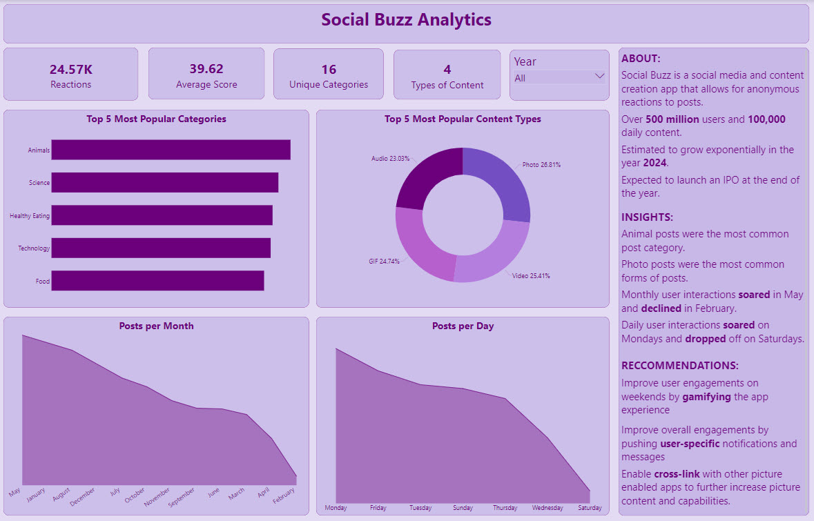

# **Social Buzz Analytics: Analyzing Social Media Activity for a Social Media Company**

## **Status:** Completed (May 8 2023 to May 22 2023)

## **Project Description**

This repository contains a portfolio project by the author based on data from a social media company as part of Accenture's virtual internship program.

The goal of this project was to analyze the data from an social media company to determine the following: 

* top 5 most popular post categories on the site

* most common type of posts on the site

* days and months with the highest amount of posts 

In order to determine popularity of posts on the site, scores from were assigned to each score from 0 -100. 

## **Tools**

Excel, PowerBI

## **Data Source**

The data used for this project was provided via the joint efforts of Accenture and Social Buzz and thus, licensing may prevent the sharing of this data. However, anyone can register for this internship [here](). 

## **Table of Contents**

This repository contains the following: 

* An [image file](https://github.com/deengini/social_buzz_analytics/blob/main/requirements.jpg) of the requirements of this project 

* A [PDF document](https://github.com/deengini/social_buzz_analytics/blob/main/Social%20Buzz%20Data%20Analytics%20Documentation.pdf) of the steps taking during the process of this project.

* A [Power BI file](https://github.com/deengini/social_buzz_analytics/blob/main/social_buzz_dashboard.pbix) which contains a report and dashboard for visualizing the data. 

* An [image file](https://github.com/deengini/social_buzz_analytics/blob/main/social_buzz_viz.jpg) which contains the same dashboard as above but easier viewing access. 

## **Project Applications**

This insights and methodology of this project can be applied in both product and marketing departments of most media content companies as follows: 

* It gives stakeholders an idea of how and when their users are using their app. This is an opportunity to deliever more targeted ads towards the right demographic. 

* It provides an opportunity to evaluate the marketability and viability of the product (app) incase of future IPOs or future assest evaluations. 
